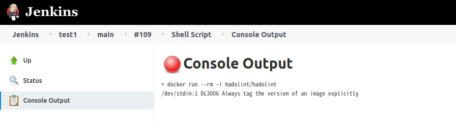
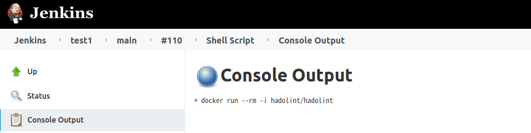
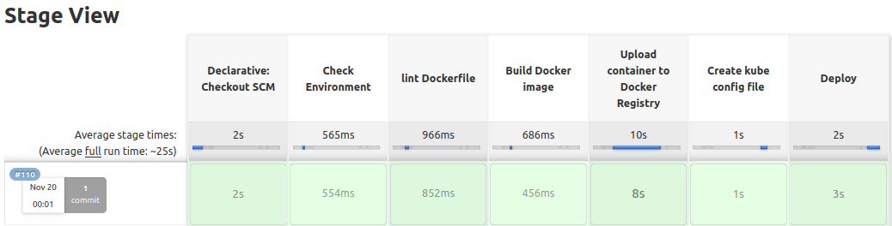
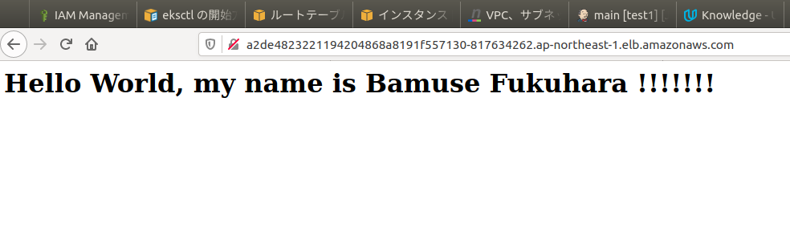

# Udacity Cloud DevOps Nanodegree program Capstone project

Create a pipeline in Jenkins to run a simple web app on Kubernetss.

Using Jenkins to implement Continuous Integration and Continuous Deployment
- Building Docker containers in pipelines
- Create an image of your application with docker files.Lint docker files
- After build, upload the image to the docker hub
- Working in AWS. Building Kubernetes clusters by AWS KES
- Kes clusters are manually pre-created.
- Finally, register with the cluster and start the service

